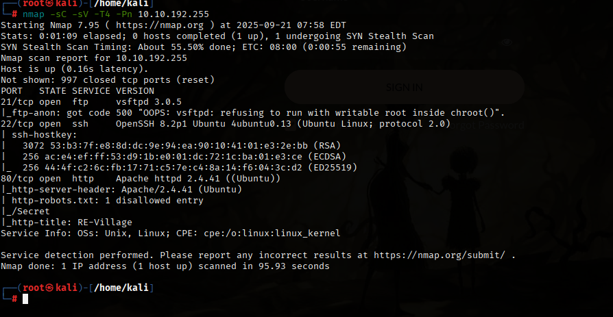
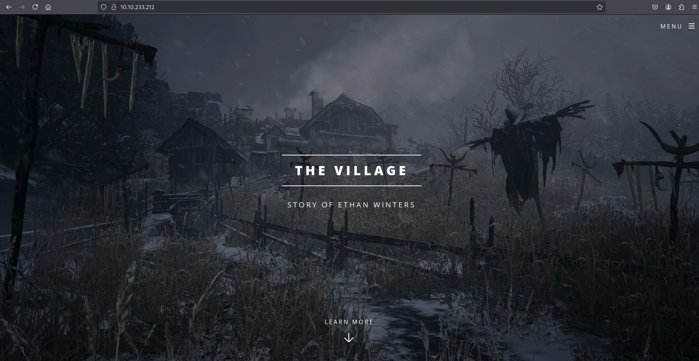
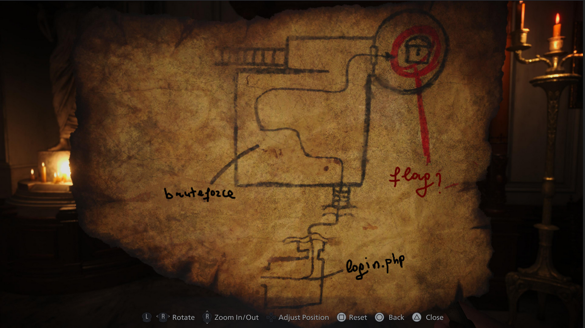
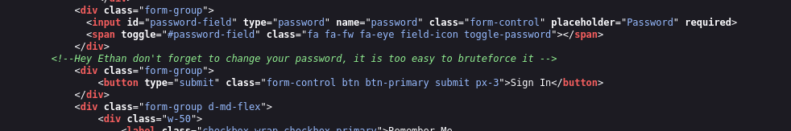
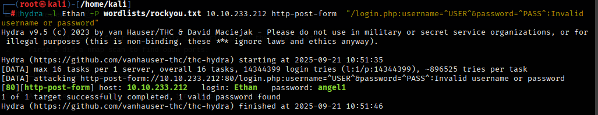
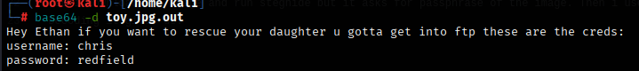
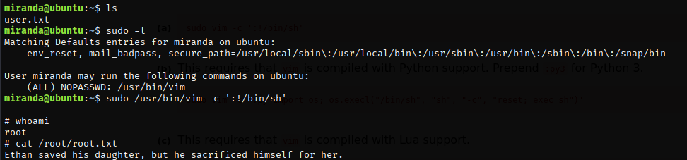

So this is my first CTF and I tried to make it fun and interesting.If you find any other way to become root you can send me them:)
<i>And one more thing, RE:village is my fav game as you can guess :D</i>

<h1>Writeup:</h1>

Let's start:

First i did a nmap scan to find open ports:

As you see 3 ports are open. First imma check the web page:

 So lets do a directory scan to find hidden directories. I used common.txt and found robots.txt. Inside robots.txt there is a /Secret file there:

 

As you see it says we have to bruteforce login page in order to find the flag.
Go to login.php and poke around u will see a message in source page:

So imma use hydra to find the pass and i will use rockyou.txt.(<i>Originally i put the password as rosemary but hydra took long time to find it eventually server wasn't responding so i changed it to something simplier...</i>)

Alright so i enter the creds we have found and we see a dashboard.php page(you will find web flag here). There is a message saying "If you see any picture take a good look inside of it."
,so i download the image and run steghide but it asks for passphrase of the image. Then i used <b>stegseek toy.jpg rockyou.txt</b> and got base64 encoded message.
Decoding it gives us: 

Entering with the creds we found we see chris.txt with rot13 encoded text. I'm not gonna put the decoded txt here but you can go to any other rot13 decoder and find ssh creds there.

To become root i will run sudo -l. We can run /usr/bin/vim as root so we can use gtfobins here and become root:

This was an easy CTF for beginners, if you have any suggestions or reviews I'm open to listen <3.

Note:<i>I didn't include any flags in this writeup</i>
